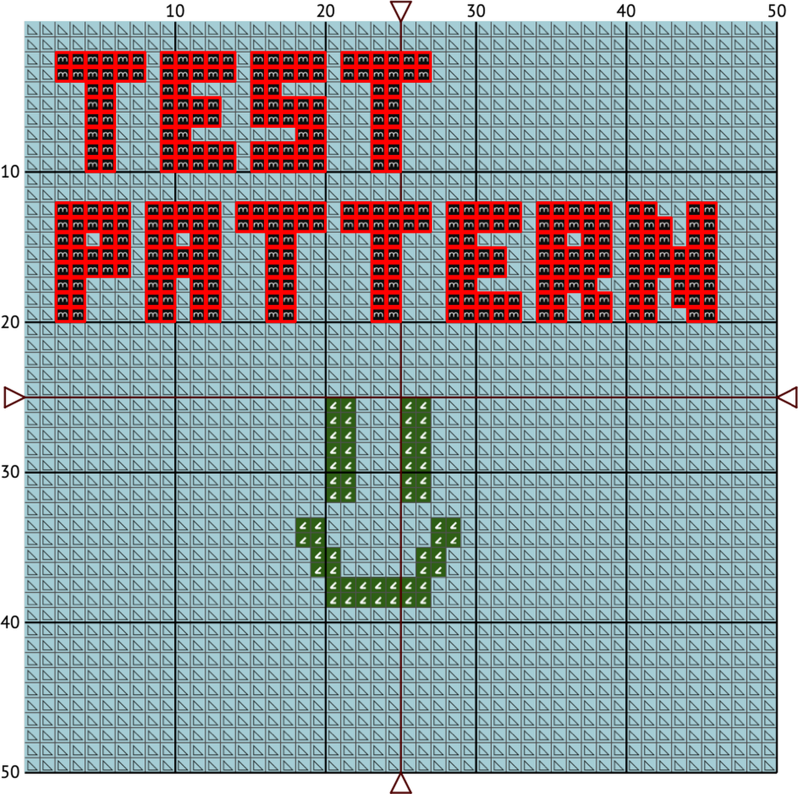
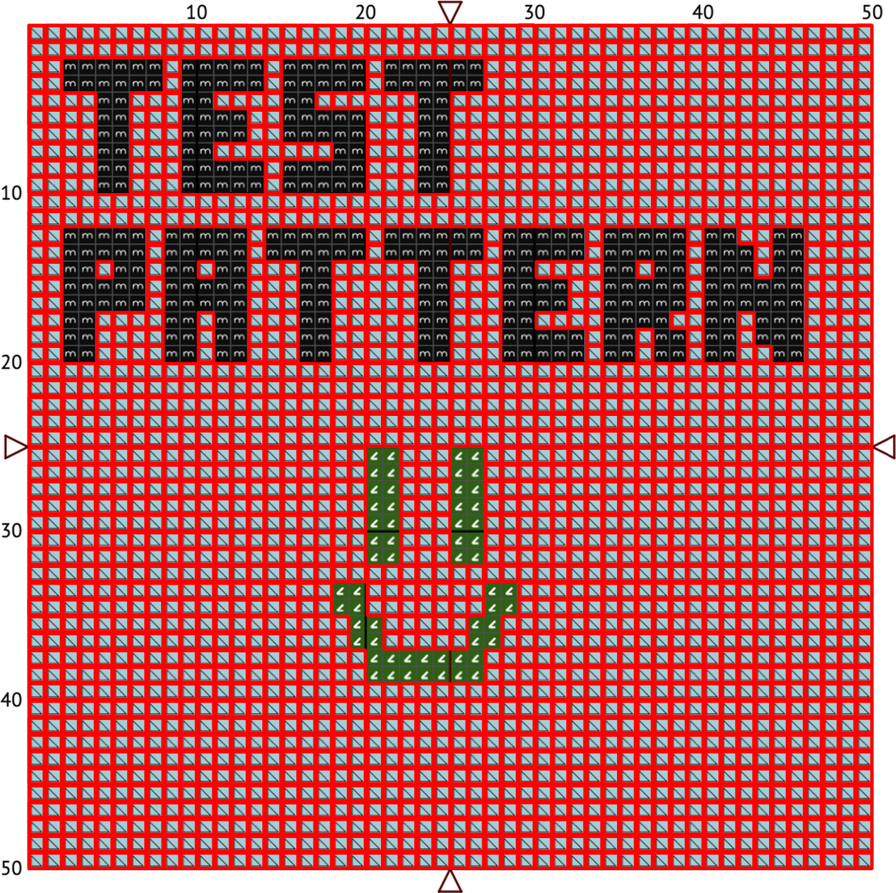
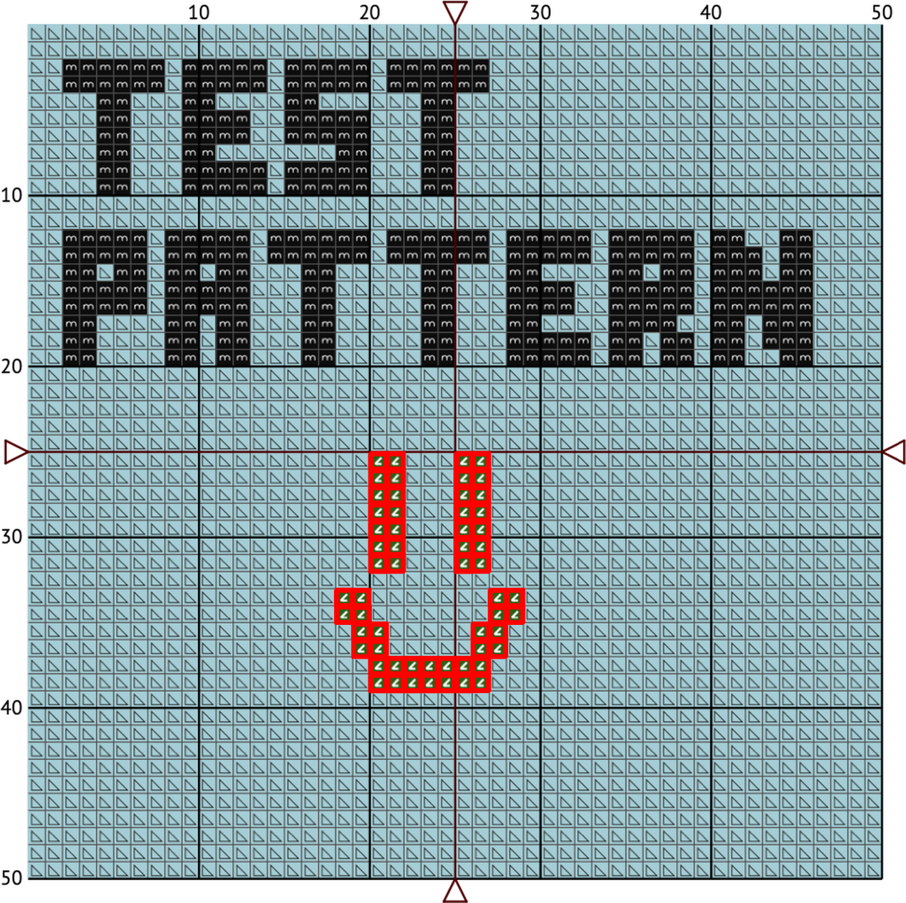
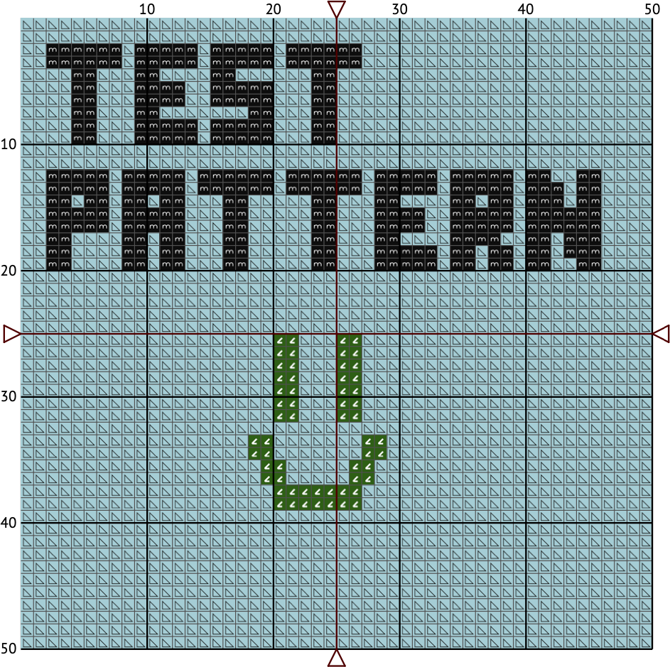

# Cross Stitch Helper

> Have you ever thought that you finished cross stitching all elements of the same color on your work?

>How many times you had to go back to stitch that one single cross?

>Isn't it a nuisance to keep changing thread colors?


What about seeing those images:





Instead of:




### I think that Cross Stitch Helper is for you, ready to use :)

Now you need to prepare only image with your pattern and simple template.

Cross Stitch Helper is a project dedicated for people struggling with finding single elements in cross stitch patterns or planning their next steps.

## How to use Cross Stich Helper:
- At first, you need to create two images (for reference go to 'example' directory):
  - scheme of your image (it should be in pretty good quality)
  - template file
- Next, you need to check thoroughly size of single cross stitch in your scheme and template.
- Then, prepare config file named 'config.ini' in your main directory.
- And finally, execute program by running: <code>pipenv run python main.py</code> [pipenv required]

## How to adjust Cross Stitch Helper settings
Unfortunately it will need some your work, but final result is definitely worth it :)

It is worth to mention that if you are planning to use multiple pages of your pattern below steps have to be done only once for single color, so after some time spent at the beginning further pages will go much faster.

1. It would be worth to start with using option "All - generate all images"
2. Go to generated images and check their correctness
3. If none elements are matched with red frame and you see them on page - you have to decrease threshold and check image preview.
4. If elements with different symbol are matched also - you have to increase threshold and check image preview.
5. To change single color threshold you can use "Single color - enter single color number" option and choose one of discovered colors or enter custom number (which could not be recognized due to too high threshold)

## Config file contents with description
```ini
[template] # Template section

# Template file name
name = test_template.png

# Single cross stich size in px
sample_width = 20

# Offset between cross stitches in px
x_offset = 1
y_offset = 1

# Rows (x) and columns (y) in template
x = 2
y = 2

# Number of colors used in pattern
number_of_colors = 3

[scheme] # Scheme section

# Scheme file name
name = test_scheme.png

# Single cross stich size in px
sample_width = 20
```

Example, how to measure cross stitch for template section:


1px - offset/borders (in this case same for x and y)

20px - sample_width (without borders)
  